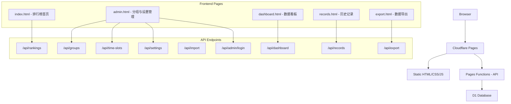

# 排行榜查询系统

Feature Name: ranking-query-system
Updated: 2026-07-15

## Description

在现有 yldk 打卡签到系统的技术栈（Cloudflare Pages + D1）基础上，构建一个独立的排名查询系统。系统以"分组 x 时段"定义全量打卡位，所有人员覆盖全部打卡位，分值汇总后形成全局排名。

## Architecture



## Data Models

### Database Schema (D1 / SQLite)

```sql
CREATE TABLE IF NOT EXISTS groups (
  id INTEGER PRIMARY KEY AUTOINCREMENT,
  name TEXT NOT NULL UNIQUE,
  order_index INTEGER NOT NULL DEFAULT 0
);

CREATE TABLE IF NOT EXISTS time_slots (
  id INTEGER PRIMARY KEY AUTOINCREMENT,
  group_id INTEGER NOT NULL,
  name TEXT NOT NULL,
  time_range TEXT NOT NULL,
  order_index INTEGER NOT NULL DEFAULT 0,
  FOREIGN KEY (group_id) REFERENCES groups(id) ON DELETE CASCADE,
  UNIQUE(group_id, name)
);

CREATE TABLE IF NOT EXISTS score_records (
  id INTEGER PRIMARY KEY AUTOINCREMENT,
  person_name TEXT NOT NULL,
  group_id INTEGER NOT NULL,
  slot_id INTEGER NOT NULL,
  score REAL NOT NULL DEFAULT 0,
  record_date TEXT NOT NULL,
  created_at TEXT NOT NULL,
  import_batch TEXT,
  FOREIGN KEY (group_id) REFERENCES groups(id),
  FOREIGN KEY (slot_id) REFERENCES time_slots(id),
  UNIQUE(person_name, group_id, slot_id, record_date)
);

CREATE TABLE IF NOT EXISTS settings (
  id INTEGER PRIMARY KEY AUTOINCREMENT,
  key TEXT NOT NULL UNIQUE,
  value TEXT,
  created_at DATETIME DEFAULT CURRENT_TIMESTAMP,
  updated_at DATETIME DEFAULT CURRENT_TIMESTAMP
);

CREATE TABLE IF NOT EXISTS announcements (
  id INTEGER PRIMARY KEY AUTOINCREMENT,
  content TEXT NOT NULL,
  is_active INTEGER DEFAULT 1,
  created_at DATETIME DEFAULT CURRENT_TIMESTAMP,
  updated_at DATETIME DEFAULT CURRENT_TIMESTAMP
);

CREATE TABLE IF NOT EXISTS admin_users (
  id INTEGER PRIMARY KEY AUTOINCREMENT,
  username TEXT NOT NULL UNIQUE,
  is_active INTEGER DEFAULT 1
);
```

### Key Design Decisions

**记录唯一性约束**: `UNIQUE(person_name, group_id, slot_id, record_date)` —— 同一人在同一天同一打卡位只有一条记录。重复导入同一份数据时，系统 SHALL 更新已有记录的分值而非重复插入。

**分组与时段的关系**: 时段通过 `group_id` 外键绑定分组，删除分组时级联删除时段 `ON DELETE CASCADE`。score_records 中的记录也通过外键关联，删除分组/时段时同步清理相关记录。

**分值字段类型**: 使用 `REAL` 类型以支持小数值。

**无人员表**: 本系统中人不绑定分组，人员姓名直接从 `score_records.person_name` 中派生，排名时按姓名分组聚合。这样无需维护独立的人员表，导入数据即自动维护人员列表。

## Components and Interfaces

### API Endpoints

所有 API 位于 `functions/api/` 目录下，通过 Cloudflare Pages Functions 的文件路由机制映射。

#### Rankings

| Method | Path | Description | Auth |
|--------|------|-------------|------|
| GET | `/api/rankings` | 获取全员排名（按总分降序） | Public |

Query params: `?name=张三` (搜索过滤)

Response:
```json
{
  "success": true,
  "data": [
    { "rank": 1, "name": "张三", "group_scores": {"A组": 2, "B组": 1}, "total_score": 3 },
    ...
  ],
  "total": 50
}
```

#### Groups

| Method | Path | Description | Auth |
|--------|------|-------------|------|
| GET | `/api/groups` | 获取所有分组 | Public |
| POST | `/api/groups` | 创建分组 | Admin |
| PUT | `/api/groups` | 更新分组（名称/排序） | Admin |
| DELETE | `/api/groups` | 删除分组 | Admin |

#### Time Slots

| Method | Path | Description | Auth |
|--------|------|-------------|------|
| GET | `/api/groups/:id/slots` | 获取某分组的所有时段 | Public |
| POST | `/api/groups/:id/slots` | 添加时段 | Admin |
| PUT | `/api/slots/:id` | 修改时段 | Admin |
| DELETE | `/api/slots/:id` | 删除时段 | Admin |

#### Records

| Method | Path | Description | Auth |
|--------|------|-------------|------|
| GET | `/api/records` | 查询记录列表（支持多维筛选） | Public |
| GET | `/api/records/cross-table` | 查询交叉表视图（行=人，列=分组-时段，值=分值） | Public |
| POST | `/api/records` | 手动添加记录 | Admin |
| PUT | `/api/records/:id` | 修改记录分值 | Admin |
| DELETE | `/api/records/:id` | 删除记录 | Admin |

Query params for list: `?start_date=&end_date=&name=&group_id=&slot_id=`
Query params for cross-table: `?start_date=&end_date=&name=&group_id=`

Cross-table response:
```json
{
  "success": true,
  "columns": [
    {"group_name": "A组", "slot_name": "08:00-11:00", "label": "A组-08:00-11:00"},
    {"group_name": "A组", "slot_name": "11:00-14:00", "label": "A组-11:00-14:00"}
  ],
  "rows": [
    {"name": "张三", "scores": {"A组-08:00-11:00": 95, "A组-11:00-14:00": 88}}
  ]
}
```

#### Import

| Method | Path | Description | Auth |
|--------|------|-------------|------|
| POST | `/api/import` | 上传 Excel 并解析导入 | Admin |

Request: `multipart/form-data` with Excel file.

Response:
```json
{
  "success": true,
  "imported": 120,
  "errors": [
    { "row": 5, "message": "分组 'C组' 不存在" }
  ]
}
```

#### Export

| Method | Path | Description | Auth |
|--------|------|-------------|------|
| GET | `/api/export/rankings` | 导出排行为 Excel（矩阵格式） | Public |
| GET | `/api/export/records` | 导出记录明细为 Excel | Public |

Export formats:
- **排名导出**: 矩阵表，列头=分组名（如"A组"、"B组"），每列的值=该分组下有时段数据的个数。末尾列=总分+排名。
- **记录明细导出**: 列表格式，字段=姓名、分组、时段、分值、日期、导入时间

排名导出示例：
| 排名 | 姓名 | A组 | B组 | 总分 |
|------|------|-----|-----|------|
| 1    | 张三 | 2   | 1   | 3    |
| 2    | 李四 | 1   | 1   | 2    |

A组有3个时段(08:00-11:00, 11:00-14:00, 20:00-23:00)，张三有2个时段有数据→A组=2

Query params for records export: `?start_date=&end_date=&name=`

#### Dashboard

| Method | Path | Description | Auth |
|--------|------|-------------|------|
| GET | `/api/dashboard` | 获取统计数据 | Public |

Response:
```json
{
  "success": true,
  "total_persons": 50,
  "total_records": 500,
  "score_distribution": [..],
  "group_averages": [..],
  "top_n": [..],
  "missing_slots": [..]
}
```

#### Admin

| Method | Path | Description | Auth |
|--------|------|-------------|------|
| POST | `/api/admin/login` | 管理员登录 | Public |
| GET | `/api/settings` | 获取系统设置 | Public |
| PUT | `/api/settings` | 更新系统设置 | Admin |
| GET | `/api/announcements` | 获取公告列表 | Public |
| POST | `/api/announcements` | 发布公告 | Admin |
| PUT | `/api/announcements/:id` | 更新/停用公告 | Admin |

### Smart Excel Import Logic

系统在解析上传的 Excel 文件时执行智能格式检测：

```
IF sheet has exactly 1 row of data OR column A contains all unique names,
   AND header columns match group-slot pair pattern (e.g., "A组 - 08:00-10:00")
    THEN parse as matrix format
ELSE IF column headers include "姓名", "分组", "时段", "分值"
    THEN parse as list format
ELSE
    THEN report error and prompt user for format selection
```

**List format** (recommended canonical form):

| 姓名 | 分组 | 时段 | 分值 | 日期 |
|------|------|------|------|------|
| 张三 | A组  | 08:00-10:00 | 95 | 2026-07-15 |

**Matrix format** (auto-detected):

| 姓名 | A组 - 08:00-10:00 | A组 - 10:00-12:00 | B组 - 14:00-16:00 |
|------|-------------------|-------------------|-------------------|
| 张三 | 95 | 88 | 92 |
| 李四 | 80 | 85 |      |

### Frontend Pages

| Page | Route | Function | Auth Required |
|------|-------|----------|---------------|
| index.html | `/` | 排行榜首页 + 搜索 | No |
| admin.html | `/admin.html` | 分组管理 + 时段管理 + 公告 + 导入 | Yes |
| dashboard.html | `/dashboard.html` | 数据看板 | No |
| records.html | `/records.html` | 历史记录（交叉表视图 + 列表视图） | No (read); Yes (edit/delete) |
| export.html | `/export.html` | 导出排名（矩阵格式）和记录明细 | No |

Records page 提供两个视图：
- **交叉表视图**: 按分组展开，每行一个人员，每列一个打卡位（"分组-时段"），显示该位是否有数据及其分值，直观展示缺失位
- **列表视图**: 传统行列表，支持筛选和增删改

## Correctness Properties

### Ranking Calculation Invariants

1. **全量打卡位一致性**: 排名计算时，全量打卡位 = 所有活动分组 x 各自的活动时段。分组或时段变更触发全量打卡位重新计算。

2. **分组得分计算**: 每个人的分组得分 = 该分组下有时段记录的个数（COUNT DISTINCT slot_id WHERE person_name = ? AND group_id = ?）。每个打卡位有数据计 1 分，缺失计 0 分。

3. **总分计算**: 总分 = 所有分组得分的总和。即 SUM(每个分组有数据的时段数)。

4. **同名处理**: 同名不同人的场景不作区分，视为同一人。如果存在同名需求，后续版本可通过人员唯一标识拓展。

5. **并列排名**: 总分相同的多人获得相同排名序号，后续排名跳过相应数量。如两人并列第 1，则下一位为第 3 名。

6. **排名实时计算**: 排名在前端请求时实时查询 D1，不缓存。D1 的 SQL 聚合查询性能足以支撑常规数据量。

## Error Handling

| Scenario | HTTP Code | Response |
|----------|-----------|----------|
| 未认证访问管理 API | 401 | `{ "success": false, "error": "未授权访问" }` |
| 导入的 Excel 格式无法识别 | 400 | `{ "success": false, "error": "无法识别的文件格式" }` |
| 导入的行引用不存在分组 | 200(partial) | `{ "success": true, "errors": [{ "row": 5, "message": "..." }] }` |
| 删除有关联记录的分组 | 400 | `{ "success": false, "error": "该分组下有记录数据，无法删除" }` |
| 数据库操作失败 | 500 | `{ "success": false, "error": "服务器内部错误" }` |
| 必填字段缺失 | 400 | `{ "success": false, "error": "xxx 不能为空" }` |

## Test Strategy

| Level | Scope | Tools |
|-------|-------|-------|
| Unit | `_shared.js` 工具函数（排名计算、格式检测） | Node.js `assert` |
| API | 每个 API 端点的请求/响应验证 | Manual / curl |
| Integration | 导入→排名→导出 完整数据流 | Manual |
| Edge Cases | 空数据库、无记录人员、全 0 分、同名冲突 | Manual |

测试文件位置: `tests/` 目录。

### Key Test Cases

1. 分组/时段 CRUD 后排名重算正确性
2. Excel 列表格式导入 @ 矩阵格式导入
3. 缺失打卡位的人员排名计算（应计 0）
4. 并列排名序号跳跃
5. 导入格式错误的边界情况（空文件、无表头、混合格式）
6. 同名人员聚合正确性

## References

[^1]: 现有系统架构 — `.monkeycode/docs/pages.md`
[^2]: 现有数据库 Schema — `schema.sql`
[^3]: 现有 API 共享模块 — `functions/api/_shared.js`
